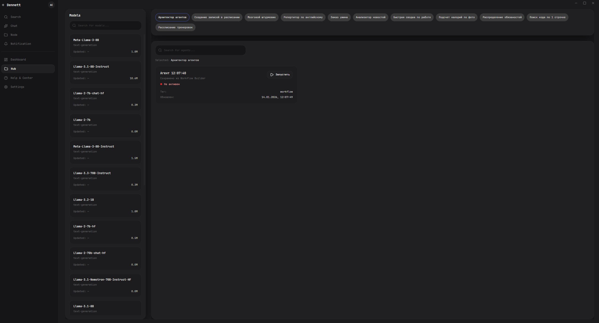
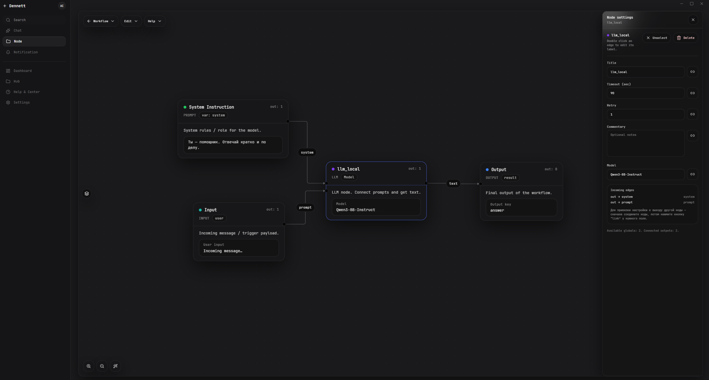
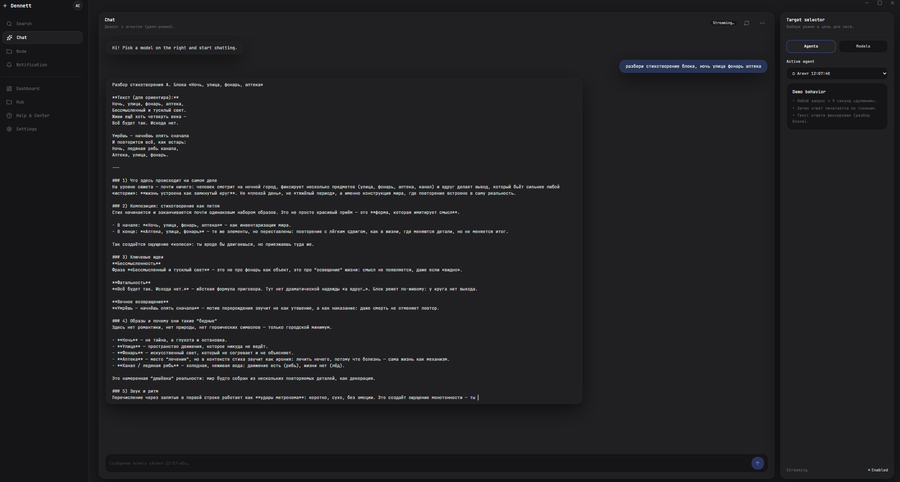

# Dennet — AI Agent Hub
[Windows] [Open Source] [Local‑First]

Dennet — кроссплатформенный open‑source десктопный ИИ‑хаб: запускайте модели на своём ПК, общайтесь с ними в удобном чате и собирайте ИИ‑агентов в визуальном no‑code конструкторе.  
Цель проекта — сделать создание персональных агентов таким же понятным, как сборка схемы из кубиков: без «магии», без лишней боли, с максимальным контролем у пользователя.

  

---

## Ключевые возможности

- **Визуальный конструктор агентов (no‑code)**  
  Собирайте логику из нод, соединяйте потоки данных, запускайте и отлаживайте поведение агента в одном месте.
- **Менеджер локальных моделей + “песочница” для общения**  
  Скачивайте, настраивайте и запускайте модели, тестируйте промпты и сценарии в чате, переключайтесь между моделями без лишних движений.
- **Local‑First и приватность**  
  Фокус на локальном выполнении и хранении данных на устройстве пользователя. Сеть используется только там, где вы сами это включили.
- **Единый хаб вместо зоопарка тулзов**  
  Одна оболочка для повседневной работы с моделями и агентами: запуск, управление, эксперименты, автоматизация.

---

## Установка

Установка — это запуск бинарника. Без установщиков и без ручной возни с зависимостями.

1) Скачайте **бинарник** под вашу ОС (раздел релизов репозитория).  
2) Запустите файл.  
3) Готово: приложение поднимет нужные компоненты и откроет панель управления.

---

## Быстрый старт

1) Откройте **Менеджер моделей** и загрузите локальную модель.  
2) Проверьте модель в **чате‑песочнице** (быстрые итерации промпта).  
3) Перейдите в **Конструктор агентов** и соберите первый сценарий из нод.  
4) Если нужно — настройте **планировщик**, чтобы запускать сценарии автоматически.

---

## Возможности подробнее

### 1) Визуальный конструктор агентов
- Граф логики: **ноды + связи** вместо километров кода.
- Явные входы/выходы: проще понимать, почему агент сделал именно так.
- Отладка сценариев: быстрее находите, где ломается цепочка.

### 2) Песочница для моделей (чат)
- Удобный чат для тестов: сравнение ответов, быстрые итерации.
- Управление сессиями: повторяемые эксперименты без хаоса.
- Переключение моделей: проверяйте один и тот же запрос на разных конфигурациях.

### 3) Менеджер моделей
- Загрузка и запуск локальных моделей (ориентация на формат **GGUF**).
- Контроль жизненного цикла: старт/стоп, состояние, базовая диагностика.
- Настройки параметров запуска — без ручного шаманства в консоли.

---

## Как это устроено

Dennet построен по принципу «пульт управления + ядро»:

- **Dennet App (UI)** — кроссплатформенный десктоп‑клиент (Tauri: Rust + React).  
  Это интерфейс, системный трей и точка управления.
- **AI Core** — фоновая служба, которая выполняет основную логику и держит API на localhost (Python + FastAPI).  
  Ядро может работать независимо от того, открыто ли окно UI.

Практический эффект:
1) **фоновые сценарии не умирают**, когда вы закрыли окно;  
2) **интерфейс остаётся отзывчивым**, даже когда ядро занято работой.

Dennet App ⇄ localhost API ⇄ AI Core

---

## Системные требования

- **ОС:** Windows 
- **Железо:** зависит от выбранных моделей. Для комфортной работы локальных моделей обычно нужен запас по RAM/VRAM.  
- **Диск:** место под модели (может быть заметным).

---

## Технологии

- **UI:** Tauri, Rust, React, TypeScript
- **Визуальный граф:** React Flow, Zustand, shadcn/ui
- **Core:** Python, FastAPI
- **Инференс локальных моделей:** llama-cpp-python
- **Данные/настройки:** SQLite

---

## Roadmap (в общих чертах)

- Расширение библиотеки нод и шаблонов агентов
- Улучшение планировщика и триггеров
- Больше инструментов отладки и профилирования сценариев
- Оптимизация управления ресурсами (CPU/GPU/RAM) при параллельных задачах

---

## Участие в разработке

Pull requests приветствуются. Если хотите предложить идею:
- откройте issue с описанием сценария и ожидаемого поведения;
- приложите примеры входных данных/шагов воспроизведения, если это баг.

---

## Лицензия

Apache 2.0 (для community‑версии проекта). См. файл LICENSE.
